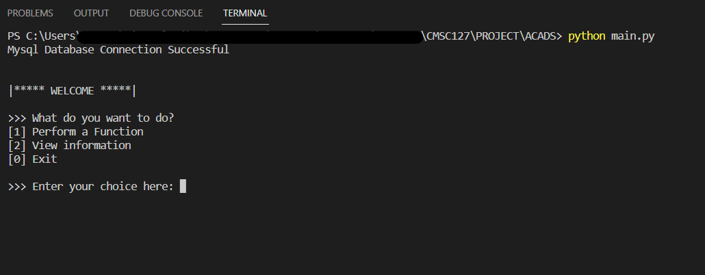

# CMSC 127 Project
An information system that will allow us to record, in electronic form, data of owed money from friend or group expenses.

## Set Up Instructions
- [1] Log in as root on MariaDB

    ``` mysql -uroot -p<your password>```
### 

- [2] Source the setup.sql file (no initial data)

    ``` source <pathof>/setup.sql ```
### 

- [3] Locate folder and run main.py

    ``` python main.py```
### 


## Group Members
- Culaniban, Ma. Deckzie
- Ureta, France William
- Vaethbrueckner, Joe-Arend
