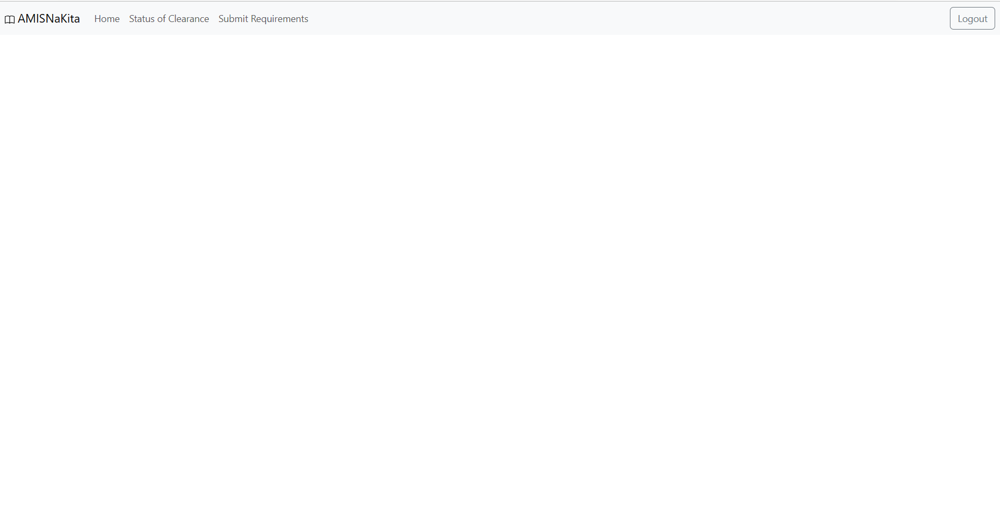

# CMSC 100 Project - Group 3

## Members
* Vincent A. Arellano
* Peter Kyle Jr M. Arpon 
* France William L. Ureta
* Prince Czedrick M. Nepomuceno
-------------------
### Milestone 01 updates
- Frontend: Sign in and Log in pagees
- BackEnd: Prep for authentication and database

### Milestone 02 updates
- Frontend: Have good navigation for each screen
- Frontend: Progressed in student view and admin view
- Frontend: Implement navbar
- Backend: Successfully login and authentication of student is done
- Backend: Controllers of user and application are done

### Milestone 03 updates
- Frontend: Have admin pages
- Frontend: Implement tables for records
- Frontend: Implement all student screen
- Frontend: Better submit reqFrontendrements
- Frontend: Display status clearance
- Frontend: Logout routing
- Backend: open / create an application
- Backend: view all applications of students
- Backend:  close application

# Clearance Application Monitoring System

This project is a clearance application system <b>CLAMS <i>Clearance Application Monitoring System</i> </b>that allows students to apply for clearance and go through the approval process. The system provides different functionalities based on user types, including students, approvers, and administrators.

## CLAMS User Types

The system supports the following user types:

- Student: A student of the institute.
- Approver: A faculty member (Can be Advisor & Clearance Approver) from the institute.
- Admin: Faculty in charge of assigning an adviser to a student, verifying accounts, and creating accounts for approvers. Admin has only 1 instance.

Take Note: Users can only have one user type.

## CLAMS Account System

The account system enables the following actions:

- Students can sign up for an account by providing their personal information and UP mail.
- Students and approvers can log in and log out of their accounts.
- The  admin user can manage student account applications, including viewing pending applications, sorting them by student number or name, approving or rejecting applications, and assigning advisers to student accounts.
- The administrative user can also manage approver accounts, including creating, editing, and deleting accounts, searching for approver accounts by name, and sorting them by name in ascending or descending order.

## CLAMS Student Functionalities

Students can perform the following actions within the system:

- Apply for approval by opening a clearance application.
- Open or close a clearance application.
- View the status of clearance applications.
- Print a PDF version of a cleared application.
- Submit requirements for clearance steps.
- Resubmit a returned application at the current step.

## CLAMS Approver Functionalities

Approvers can perform the following actions within the system:

- See a list of pending applications that require their attention, with options for searching, filtering, and sorting.
- Review applications submitted by students, including links/info submitted by the student at any step and remarks given to the student at any step.
- Approve applications at the current step.
- Return applications at the current step with remarks.

## CLAMS System for Approval

The approval process in the system follows these steps:

- Student opens an application and enters necessary information for Step 1 (Adviser approval), including a link to a GitHub repository.
- Student submits the application for the adviser's review.
- The adviser reviews the application and can either approve it, which moves it to the next step, or return it with remarks, allowing the student to make necessary changes and resubmit.
- The clearance officer reviews the application and can either approve it, which advances it to the final step, or can return like the first one.
- If the application is approved, it proceeds to Step 4, where it is automatically closed with a "Cleared" status. The student receives a notification and a PDF version of the cleared application for printing.
